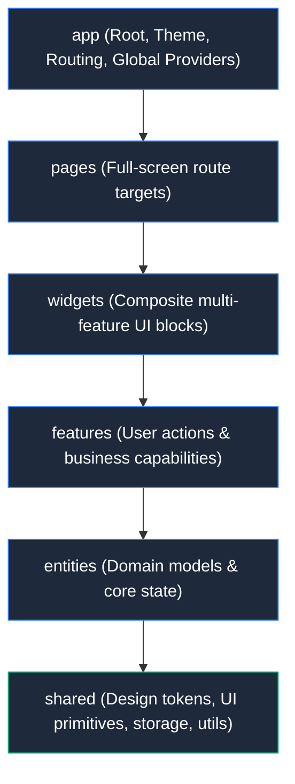

# Feature-Sliced Design (FSD v2.1) Architecture Specification

## 1. Overview

This project uses **Feature-Sliced Design (FSD v2.1)** to structure the Flutter codebase into decoupled, highly cohesive, domain-driven layers. FSD ensures that the codebase scales seamlessly when developed collaboratively by human developers and autonomous AI coding agents.

---

## 2. Layers Specification

### Layer 1: `app`
- **Responsibility**: Application initialization, root `MaterialApp`, theme configuration (`AppTheme`), unified scroll behaviors (`AppScrollBehavior`), and top-level provider overrides.
- **Allowed Imports**: May import from all layers (`pages`, `widgets`, `features`, `entities`, `shared`).
- **Cannot Be Imported By**: Any other layer.

### Layer 2: `pages`
- **Responsibility**: Full-screen compositions and route destinations. A page gathers composite widgets and features into complete user views (e.g. `HomePage` dispatching to `WearableHomeView`, `PhoneHomeView`, `FoldHomeView`, or `DesktopHomeView`).
- **Allowed Imports**: `widgets`, `features`, `entities`, `shared`.
- **Cannot Import**: `app`.

### Layer 3: `widgets`
- **Responsibility**: Composite, multi-feature UI components that bridge multiple features and entities without creating direct feature-to-feature dependencies (e.g., `AdaptiveScaffold`, `FormFactorPreviewFrame`).
- **Allowed Imports**: `features`, `entities`, `shared`.
- **Cannot Import**: `app`, `pages`.

### Layer 4: `features`
- **Responsibility**: Discrete, user-facing capabilities and user interactions (e.g., `theme_toggle`, `device_simulator`, `sample_action`). Each feature slice contains its UI, state management, and interaction handling.
- **Allowed Imports**: `entities`, `shared`.
- **Cannot Import**: `app`, `pages`, `widgets`, or sibling `features`.

### Layer 5: `entities`
- **Responsibility**: Core business domain concepts, persistent data structures, repositories, and state models (e.g., `app_settings`, `user`, `catalog_item`).
- **Allowed Imports**: `shared`.
- **Cannot Import**: `app`, `pages`, `widgets`, `features`, or sibling `entities`.

### Layer 6: `shared`
- **Responsibility**: Reusable foundational infrastructure completely decoupled from business domain logic (design system tokens, typography, atomic UI primitives, responsive breakpoints, storage adapters, date helpers, platform channels).
- **Allowed Imports**: External Flutter SDK & pub packages only.
- **Cannot Import**: Any application layer (`entities`, `features`, `widgets`, `pages`, `app`).

---

## 3. The Three Golden Rules of FSD

1. **Unidirectional Import Flow**: A file may **ONLY** import code from layers strictly lower than its own layer.
2. **Horizontal Slice Isolation**: Slices within the same layer (`features/foo` and `features/bar`) must **NEVER** import each other directly. Interactions must be orchestrated upwards at the `widgets` or `pages` layer via composition, callbacks, or shared entities.
3. **Public API Barrels**: Every slice must expose its capabilities via a single public barrel file (`<slice>.dart`). External callers must never reach into private inner subdirectories.

`app` and `shared` have no slices: they are split into **segments** (`app/theme`, `shared/ui`, `shared/lib`, `shared/api`) that may import each other. Other layers consume `shared` through `shared/shared.dart`.

---

## 4. Automated Architecture Enforcement

To ensure AI agents and contributors strictly adhere to FSD:
- **CLI import scanner**: `dart run tool/verify_fsd.dart --strict` scans every `import` and `export` directive in `lib/` (line-based, not a full AST parse) and reports upward layer imports, cross-slice imports and deep imports that bypass a public barrel. Without `--strict` it only prints the report.
- **Automated test**: `flutter test test/architecture/fsd_architecture_test.dart` runs the same auditor, plus fixture tests proving each rule fires.
- **CI**: `.github/workflows/ci.yml` runs the audit, `flutter analyze` and `flutter test` on every push to `main` and on pull requests.

---

## 5. File Size & Componentization Standard (<= 300 LOC)

To maintain long-term architectural hygiene and code scannability across all FSD slices:
- **Maximum File Threshold**: All Dart source files must ideally remain **under 300 lines of code (LOC)**.
- **Componentized Sub-Directories**: Large multi-responsibility files (such as modals, compound views, and complex page orchestrators) must be broken down into modular, single-responsibility sub-widgets organized in a `components/` or `views/` subfolder within their parent slice.
- **Doctype & Documentation Comments**: Every component, public class, method, and state provider must be documented with comprehensive Dart doc comments (`///`) detailing purpose, input contracts, and layer roles.
- **Current Status**: All source files in the repository adhere strictly to the <= 300 LOC target.

---

## 6. Strict Design Token Consistency & Zero Hardcoded Colors

- **Zero Hardcoded Colors**: Constructing colors directly with `Color(0x...)` or random hex literals is strictly prohibited across UI widgets, modals, views, and custom painters.
- **Single Source of Truth**: All palette shades, backgrounds, text colors, borders, shadows, and radii must reference `AppTokens`, `AppPalette.of(context)`, or `Theme.of(context)`.
- **Theme Integrity**: Consistent light, dark, and high-contrast behavior must be preserved without visual fragmentation. Always inspect components across all supported themes.
